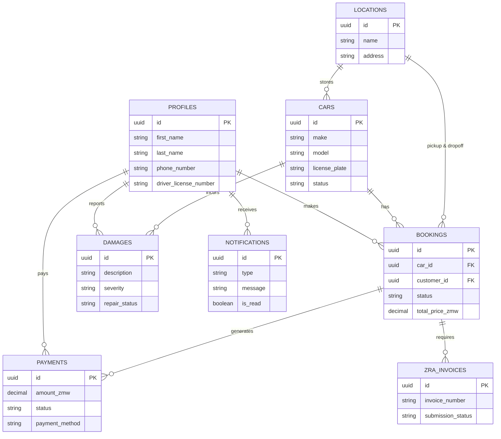

# Car Rental Portal Architecture

## 1. Executive Summary
This document outlines the architectural roadmap for a scalable car rental platform. The platform is designed to launch quickly with core booking functionality, fleet management, and robust transaction handling.

## 2. Technology Stack
- **Frontend:** React (TypeScript) for web application UI.
- **Backend API:** ASP.NET Core Web API (C#) for handling complex business logic, billing, and scheduling.
- **Database:** Supabase (PostgreSQL) for relational data and authentication.
- **ORM:** Entity Framework Core (via Npgsql provider).

*Why this stack?* The combination of React and Supabase allows for rapid frontend development and secure authentication. ASP.NET Core provides a strongly typed, high-performance backend suitable for enterprise-scale operations, ensuring robust integrity for financial transactions and booking logic.

---

## 3. Core Features

- User registration and authentication (via Supabase Auth).
- Vehicle inventory and branch location management (Admins).
- Browsing available vehicles and creating bookings (Customers).
- Checking scheduling conflicts to prevent double-booking.
- Handling payments, damage reports, and tax compliance (ZRA Invoices).

---

## 4. Database Schema

The database relies on PostgreSQL via Supabase. The schema has been heavily expanded to support comprehensive fleet management, multiple locations, damage reports, and tax compliance (ZRA Invoices). 

A complete initialization SQL script is available in `database_schema.sql`.

---

## 5. System Components & Flow

### Frontend (React)
- **Role:** Presents data to the user.
- **Communication:** Makes standard HTTP REST requests to the .NET API. Uses Supabase SDK for client-side authentication.

### Backend API (.NET Core)
- **Role:** Central business brain.
- **Endpoints:** Exposes secure REST endpoints for business logic, payment processing, and ZRA compliance.

### Database (Supabase)
- **Role:** Persistent relational storage and user authentication.
- **Security:** Uses Row Level Security (RLS) to ensure users can only access their own profiles and bookings.
